# 2021Wanxiang-Blockchain-Hackathon-TimeRose

## 项目背景

#### 推动我国数字经济健康发展
2021年10月18日，中共中央政治局就推动我国数字经济健康发展进行第三十四次集体学习。习近平总书记在主持学习时强调，近年来，互联网、大数据、云计算、人工智能、区块链等技术加速创新，日益融入经济社会发展各领域全过程，数字经济发展速度之快、辐射范围之广、影响程度之深前所未有，正在成为重组全球要素资源、重塑全球经济结构、改变全球竞争格局的关键力量。要站在统筹中华民族伟大复兴战略全局和世界百年未有之大变局的高度，统筹国内国际两个大局、发展安全两件大事，充分发挥海量数据和丰富应用场景优势，促进数字技术与实体经济深度融合，赋能传统产业转型升级，催生新产业新业态新模式，不断做强做优做大我国数字经济。

我国要加强关键核心技术攻关，牵住自主创新这个“牛鼻子”，发挥我国社会主义制度优势、新型举国体制优势、超大规模市场优势，提高数字技术基础研发能力，打好关键核心技术攻坚战，尽快实现高水平自立自强，把发展数字经济自主权牢牢掌握在自己手中。

#### 元宇宙如火如荼，基础设施亟待完善
什么是元宇宙？元宇宙这一词随着资本市场的关注逐渐引发热议，但是还仍有许多人不了解这一概念。《元宇宙》和《元宇宙通证》作者赵国栋表示，元宇宙是人们娱乐、生活乃至工作的虚拟时空。元宇宙的核心是数字创造、数字资产、数字交易、数字货币和数字消费，尤其是在用户体验方面，达到了真假难辨、虚实混同的境界。元宇宙具备从虚拟物品生产到消费的宏观产业链条的闭环，从而形成以虚拟商品为主要交易对象的独立经济体系。元宇宙经济学呼之欲出，成为数字经济中最活跃、最具革命性的部分。共创、共享、共治是元宇宙的基本价值观。在元宇宙中生活、工作正在成为 M 世代（元宇宙世代）亚文化中的一部分，进而形成社会思潮，从而重塑元宇宙社会， 并影响现实社会。在传统文化和元宇宙文化相互渗透融合中，人类文明或将被重新塑造。

大约再过 15 年，互联网就可能会发生一次重大的变革。正如从 PC 为主要上网终端过渡到移动互联网，现在也将由移动互联网过渡到 VR/AR 等元宇宙生态，开始互联网下一个 15 年的演变周期，人类将迎来互联网大变局的前夜。在认知层，元宇宙突破了想象的极限，创造自由自在的世界（见表）。元宇宙的世界都是由人们所思所想直接幻化而成的，是人类精神的外在表现，是“我心即宇宙，宇宙即我心”的三维呈现。元宇宙秉持共创、共享、共治的价值观，在生产力、生产关系、上层建筑等方面达到了统一。元宇宙经济则由数字身份、数字资产、数字市场、数字货币、数字消费等关键要素形成的完整经济体系。基本特征体现为沉浸式体验、自由创造、社交网络、经济系统和文明形态。元宇宙综合了人类在各个领域的尖端技术，包括区块链、5G、人工智能、3D 引擎、VR/AR/XR、脑机接口。这些基础构成了元宇宙的基础设施。

## 元宇宙与基于IPFS的数据宇宙
#### 元宇宙解剖

#### 元宇宙操作系统
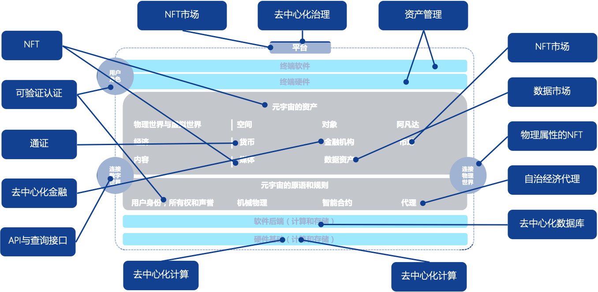

#### 基于IPFS的数据宇宙
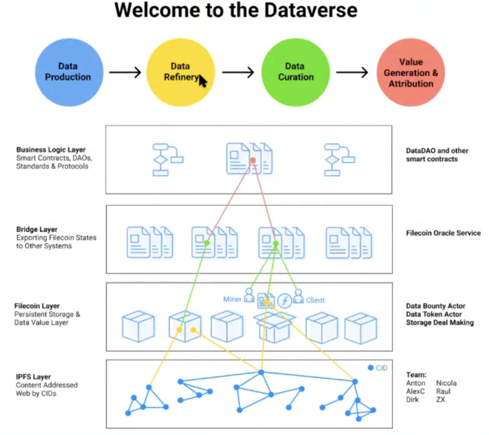

#### 元宇宙与数据宇宙的关系
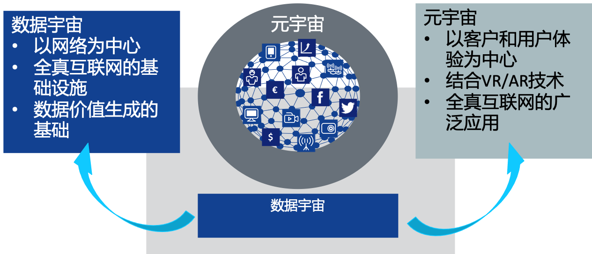

##TimeRose:构建数据宇宙的控制平面
#### 为什么构建控制平面？
###### 当搜索与市场开始融合
###### 当CDN与SDN开始融合
###### 当数据宇宙与数据湖融合
###### 当智能合约与通用计算融合
###### 当云原生service mesh与Web3融合

#### 在IPFS中引入计算
###### 内容寻址网络
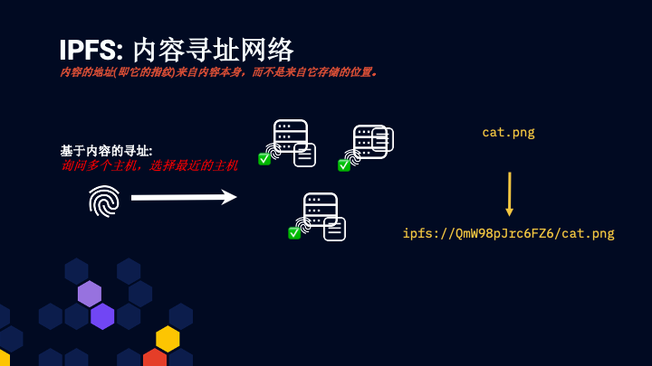
###### 计算寻址网络
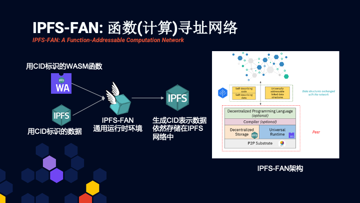
###### 存储和计算统一为CID
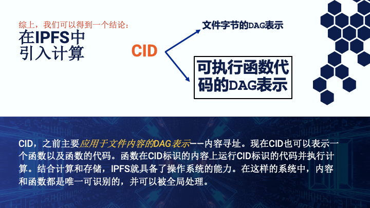

#### 在IPFS-FAN中引入计算网格

###### 当前问题: 目前Web3领域的所有计算类型都无法提供通用计算
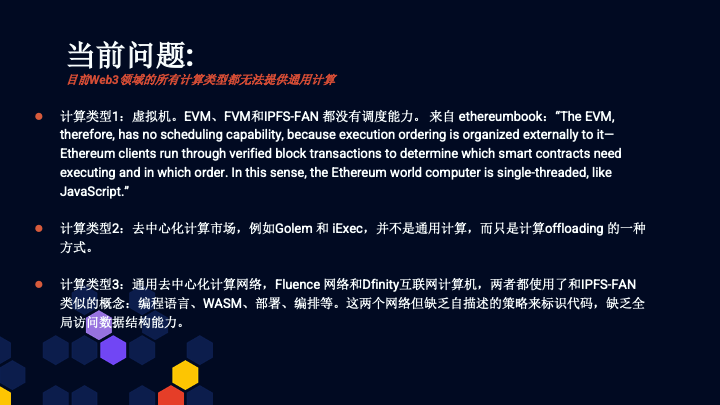
###### 解决方案: 在IPFS-FAN之上构建计算网格
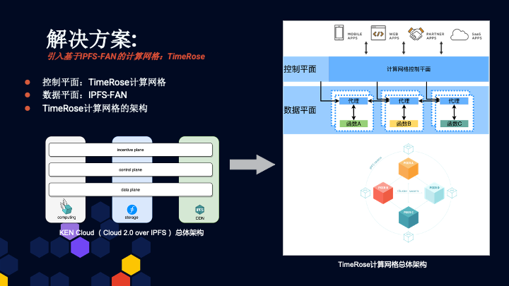
###### TimeRose 计算网格的架构
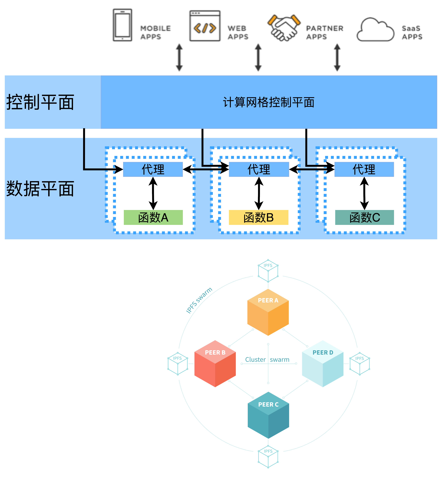
###### TimeRose 计算网格的功能
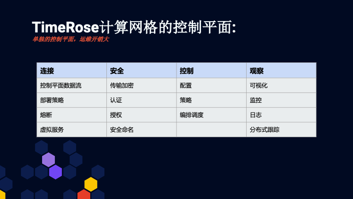
###### TimeRose 计算网格的用例

全球无服务器基础设施。通过CID来部署、调用、运行代码的能力，使得应用开发者不需要服务器基础设施。

负载均衡和就近服务。根据DHT分布计算和存储，迁移计算靠近存储。

提升后端服务的高可用性。可以分别设置计算和存储的副本数，依此来控制服务的高可用性。

协作计算和计算外包。联邦机器学习。新型云计算企业。

###### TimeRose Demo 说明

###### Scheduler
用于就近调度计算节点，并告知客户端该节点的PubSub通道，用于发送任务消息和接收结果

###### Executor
计算节点，从PubSub中接收任务消息，在docker:lambda中计算并将结果输出在PubSub中

###### Client
客户端。向Scheduler请求调度最近计算节点，然后和计算节点通过PubSub提交任务并得到结果
###### demo 架构
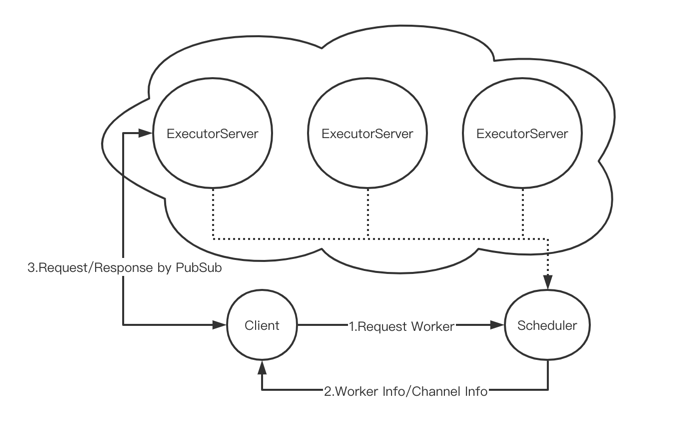

## 关于凯云实验室

凯云实验室的目标是创建一个具有丰富产品影响力的研究环境，并建立一个积极受益于研究的产品环境。

一些最激动人心的研究能够催生我们今天还无法想象的新产品，甚至新业务。

